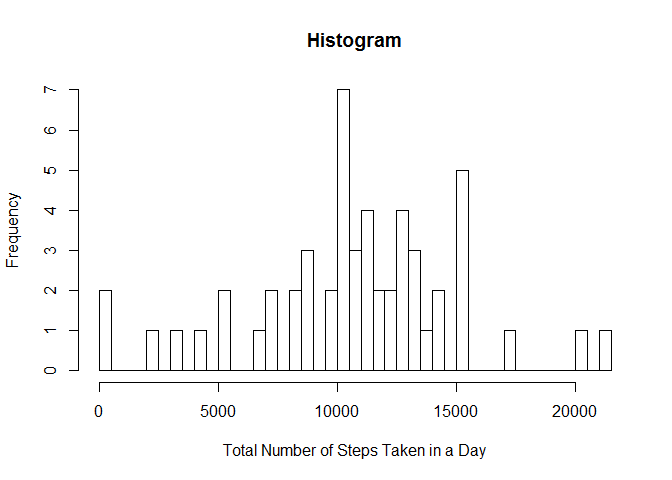
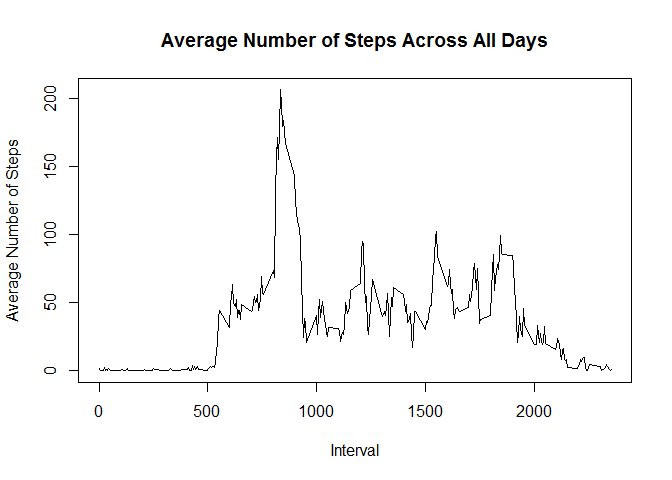
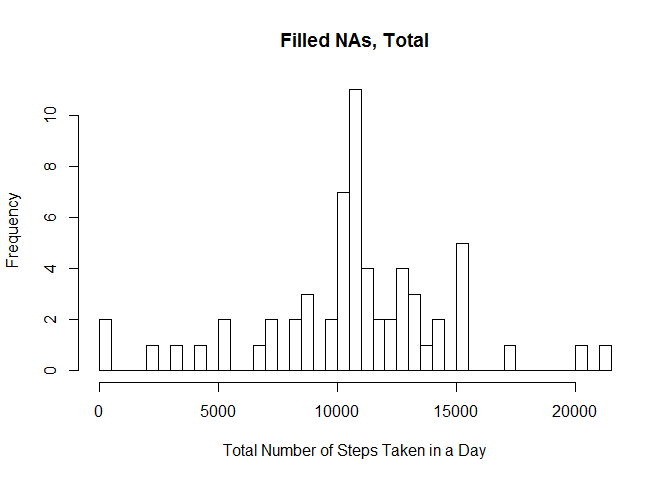
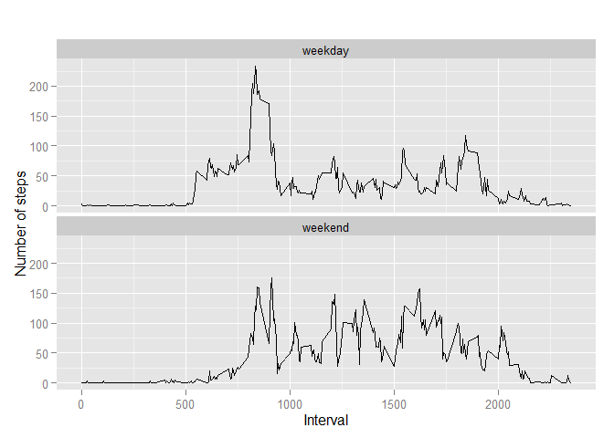

# Reproducible Research: Peer Assessment 1


## Loading and preprocessing the data


```r
url <- "http://d396qusza40orc.cloudfront.net/repdata%2Fdata%2Factivity.zip"
download.file(url,destfile="./ActivityMonitoringData.zip")
unzip("./ActivityMonitoringData.zip")

library(data.table)
activity <- data.table(read.csv("./activity.csv",na.strings="NA", header=TRUE))

names(activity)
```

```
## [1] "steps"    "date"     "interval"
```

```r
activity$date = as.Date(as.POSIXlt(activity$date, "%Y-%m-%d"))
```

```
## Warning in strptime(xx, f <- "%Y-%m-%d %H:%M:%OS", tz = tz): unknown
## timezone '%Y-%m-%d'
```

```
## Warning in as.POSIXct.POSIXlt(x): unknown timezone '%Y-%m-%d'
```

```
## Warning in strptime(xx, f <- "%Y/%m/%d %H:%M:%OS", tz = tz): unknown
## timezone '%Y-%m-%d'
```

```
## Warning in as.POSIXct.POSIXlt(x): unknown timezone '%Y-%m-%d'
```

```
## Warning in strptime(xx, f <- "%Y-%m-%d %H:%M", tz = tz): unknown timezone
## '%Y-%m-%d'
```

```
## Warning in as.POSIXct.POSIXlt(x): unknown timezone '%Y-%m-%d'
```

```
## Warning in strptime(xx, f <- "%Y/%m/%d %H:%M", tz = tz): unknown timezone
## '%Y-%m-%d'
```

```
## Warning in as.POSIXct.POSIXlt(x): unknown timezone '%Y-%m-%d'
```

```
## Warning in strptime(xx, f <- "%Y-%m-%d", tz = tz): unknown timezone '%Y-%m-
## %d'
```

```
## Warning in as.POSIXct.POSIXlt(x): unknown timezone '%Y-%m-%d'
```

```
## Warning in strptime(x, f, tz = tz): unknown timezone '%Y-%m-%d'
```

```r
activity$steps = as.numeric(activity$steps)
```

## What is mean total number of steps taken per day?


```r
totalsteps <- aggregate(steps ~ date, activity, sum)
totalsteps$date <- as.Date(as.POSIXlt(totalsteps$date))

hist(totalsteps$steps, breaks=nrow(totalsteps), xlab="Total Number of Steps Taken in a Day", main="Histogram")
```

 

```r
mean(totalsteps$steps)
```

```
## [1] 10766.19
```

```r
median(totalsteps$steps)
```

```
## [1] 10765
```


## What is the average daily activity pattern?


```r
intervalmean <- aggregate(steps ~ interval, activity, mean)
plot(intervalmean$interval,intervalmean$steps,type="l", xlab="Interval",ylab="Average Number of Steps", main="Average Number of Steps Across All Days")
```

 

```r
intervalmean[which.max(intervalmean$steps),"interval"]
```

```
## [1] 835
```

## Imputing missing values


```r
NAdf <- activity[!complete.cases(activity),]
nrow(NAdf)
```

```
## [1] 2304
```

```r
##Replace the NA with the average value for that interval.

activityfilled <- activity

for (i in 1:nrow(activityfilled)){
  if(is.na(activityfilled$steps[i])){
    intr <- activityfilled$interval[i]
    row <- which(intervalmean$interval==intr)
    mean_v <- intervalmean[row,"steps"]
    activityfilled$steps[i] <- mean_v
  }
}

totalfilled <- aggregate(steps ~ date, activityfilled, sum)
hist(totalfilled$steps,breaks=nrow(totalfilled),main="Filled NAs, Total",xlab="Total Number of Steps Taken in a Day")
```

 

```r
mean(totalfilled$steps)
```

```
## [1] 10766.19
```

```r
median(totalfilled$steps)
```

```
## [1] 10766.19
```

```r
#The mean did not change in value, but the median became equal to the mean.
```

## Are there differences in activity patterns between weekdays and weekends?


```r
activity$day <- weekdays(activity$date)

activity$dayfactor <- c("weekday")

for(i in 1:nrow(activity)){
  if(activity$day[i]== "Saturday" | activity$day[i]=="Sunday"){
    activity$dayfactor[i] <- "weekend"
  }  
}

activity$dayfactor <- as.factor(activity$dayfactor)

imputed <- aggregate(steps ~ interval+dayfactor, activity, mean)


library(ggplot2)

qplot(interval, steps, data=imputed, geom=c("line"), xlab="Interval", ylab="Number of steps", main="") + facet_wrap(~ dayfactor, ncol=1)
```

 


